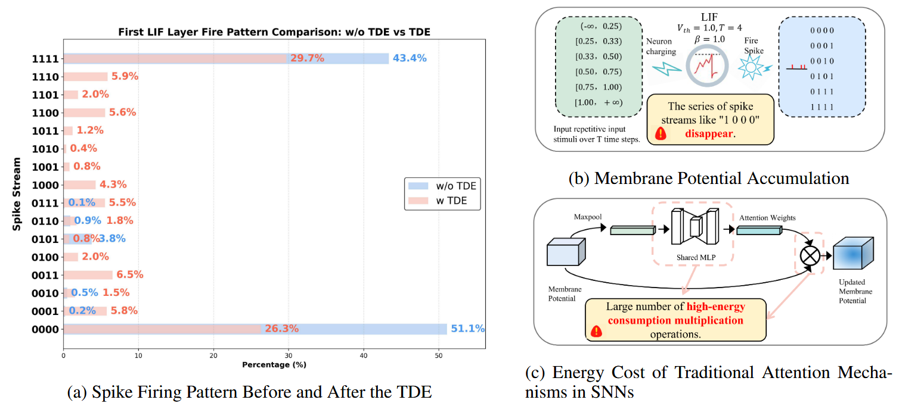
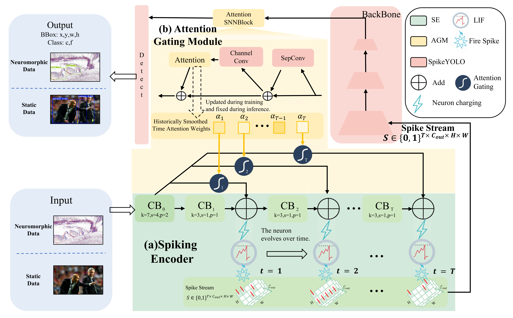
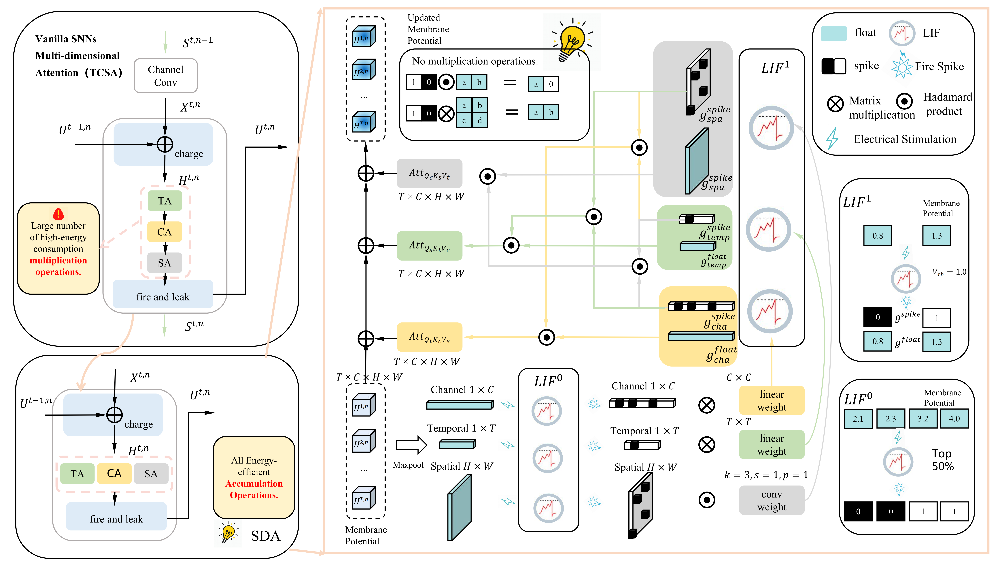

<div align="center">
  <h1>🔥[AAAI 2026 (Oral)] Temporal Dynamics Enhancer for Directly Trained Spiking Object Detectors</h1>
  <p>
    
    <a href="https://github.com/Mortal825/TDE" target="_blank">🐙 <strong>Code</strong></a> |
    <a href="http://arxiv.org/abs/2512.02447" target="_blank">📄 <strong>Paper</strong></a>
  </p>

<h2>Abstract</h2> 

<div style="width: 100%; text-align: center; margin:auto;">
      
</div>

<div style="max-width: 850px; margin: auto; font-size: 16px; line-height: 1.75; text-align: justify;">
  <p>
  Spiking Neural Networks (SNNs), with their brain-inspired spatiotemporal dynamics and spike-driven computation, have emerged as promising energy-efficient alternatives to Artificial Neural Networks (ANNs). However, existing SNNs typically replicate inputs directly or aggregate them into frames at fixed intervals. Such strategies lead to neurons receiving nearly identical stimuli across time steps, severely limiting the model's expressive power—particularly in complex tasks like object detection. In this work, we propose the Temporal Dynamics Enhancer (TDE) to strengthen SNNs' capacity for temporal information modeling. TDE consists of two modules: a Spiking Encoder (SE) that generates diverse input stimuli across time steps, and an Attention Gating Module (AGM) that guides the SE generation based on inter-temporal dependencies. Moreover, to eliminate the high-energy multiplication operations introduced by the AGM, we propose a Spike-Driven Attention (SDA) to reduce attention-related energy consumption. Extensive experiments demonstrate that TDE can be seamlessly integrated into existing SNN-based detectors and consistently outperforms state-of-the-art methods, achieving mAP@50-95 scores of 57.7% on the static PASCAL VOC dataset and 47.6% on the neuromorphic EvDET200K dataset. In terms of energy consumption, the SDA consumes only 0.240× the energy of conventional attention modules.
  </p>
</div>

<h2>Method</h2> 
<div style="display: flex; justify-content: center; align-items: flex-start; gap: 30px; width: 100%; margin: auto;">
    <!-- 左边图块：TDE -->
    <div style="width: 45%; text-align: center;">
        
        <div style="font-size: 14px; text-align: left; margin-top: 10px;">
            <b>TDE:</b>The Temporal Dynamics Enhancer (TDE) consists of two main components:
            the spiking encoder (SE), which generates diverse spike stimuli based on LIF dynamics,
            and the Attention Gating Module (AGM), which applies multi-dimensional attention 
            to modulate SE's spike stream and enhance temporal modeling.
        </div>
    </div>
    <!-- 右边图块：SDA -->
    <div style="width: 45%; text-align: center;">
        
        <div style="font-size: 14px; text-align: left; margin-top: 10px;">
            <b>SDA:</b> Schematic of the Spike-Driven Attention. SDA uses two neuron groups 
            to avoid multiplication operations. It fuses spike and floating-point temporal, spatial, 
            and channel attention weights through cross-attention, obtaining the updated membrane 
            potential without hadamard or matrix multiplications.
        </div>
    </div>
</div>
</div>

## Installation

### Requirements
- Python: 3.8.20
- PyTorch: 2.0.0
- CUDA: 12.1
- SpikingJelly: 0.0.0.0.14

For training and testing, you need to install dependencies as follows:

```shell
conda create -n Spiking python==3.8
conda install pytorch==2.0.0 torchvision==0.15.0 torchaudio==2.0.0 pytorch-cuda=11.8 -c pytorch -c nvidia
pip install spikingjelly
pip install -r requirements.txt
cd TDE
```

## Training & Evaluation

### Datasets
We use static datasets [COCO](https://www.kaggle.com/datasets/aishwr/coco2017), [VOC](https://www.kaggle.com/datasets/bardiaardakanian/voc0712), and the neuromorphic dataset [EvDET200k](https://github.com/Event-AHU/OpenEvDET) to evaluate the effectiveness of TDE. Please download them to any directory, and modify the configuration files under `./config`, including `coco.yaml`, `VOC.yaml`, `VOC07.yaml`, and `EvDET200K.yaml`.

The dataset is organized into two directories: `images`, which contains the image files, and `labels`, which holds the annotations in YOLO format. Each label file corresponds to an image and contains object annotations formatted as: `<class_id> <x_center> <y_center> <width> <height>`, with the coordinates and dimensions normalized. (refer to `./yolo2voc` for conversion details).


### Training

We implement the training process in `python train.py`, which includes functions for loading various modules and datasets. The model can be chosen by uncommenting the respective line.

To start training, run the following command:
```python
python train.py
```

### Evaluation

After inference, you can evaluate the results using metrics like mAP50, mAP50-95, and by calculating the spike firing rates of LIF neurons for power estimation.

```shell
python test.py
```
Partial weights download link: [weights](https://drive.google.com/drive/folders/1JG0yjFjp5cRpnMayEsfjJuHtyJ8wfoF-?usp=drive_link)


## Acknowledgements

This work is based on [EMSYOLO](https://github.com/BICLab/EMS-YOLO),[SpikeYOLO](https://github.com/BICLab/SpikeYOLO),[DeQA-OpenEvDET](https://github.com/Event-AHU/OpenEvDET),[Spike-Driven-Transformer-V2](https://github.com/BICLab/Spike-Driven-Transformer-V2),[ultralytics](https://github.com/ultralytics/ultralytics). Sincerely thanks for this awesome work.

## Citation

If you find our work useful for your research and applications, please cite using the BibTeX:

```bibtex
@article{luo2025tde,
  title={Temporal Dynamics Enhancer for Directly Trained Spiking Object Detectors},
  author={Luo, Fan and Gao, Zeyu and Luo, Xinhao and Zhao, Kai and Lu, Yanfeng},
  journal={arXiv preprint arXiv:2512.02447},
  year={2025},
}
```